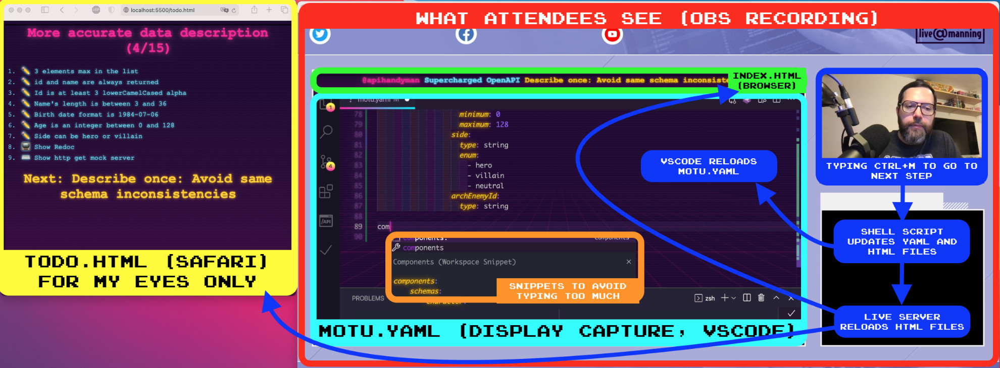

# Supercharged OpenAPI Session Repository #

This repository was the one I used during my Supercharged OpenAPI session done during the [Manning Live API Conference](https://freecontent.manning.com/livemanning-conferences-apis/).

# Tools used/shown during the session

- The session was recorded using [OBS Studio](https://obsproject.com) and everything was done in [VS Code](https://code.visualstudio.com) (see below for more details)
- At the beginning I draw rainbow like rectangles on the screen using [ScreenBrush](https://apps.apple.com/us/app/screenbrush/id1233965871?mt=12)
- The [Redoc](https://github.com/Redocly/redoc) and [Swagger UI](https://github.com/swagger-api/swagger-ui) rendering of OpenAPI document were done thanks to the [OpenAPI (42 Crunch) VS Code Extension](https://marketplace.visualstudio.com/items?itemName=42Crunch.vscode-openapi)
- The mock API was generated with [Stoplight Prism](https://github.com/stoplightio/prism/) based on the OpenAPI document coded along the session
- The "tree like OpenAPI documentation" shown in the end is my [OpenAPI Map](https://openapi-map.apihandyman.io/)
- The GUI allowing to not write OpenAPI code briefly shown in the end is [Stoplight Studio](https://stoplight.io/studio/)

# The magic behind what you've seen

Before starting to talk, I:

- Open this repo with  VS Code
- Start a live server listening to change (it runs on http://localhost:5500)
- Run the task "Reset Step"
- Start OBS

Then while I'm talking and modifying the `motu.yaml` file, I regularly hit <kbd>ctrl</kbd><kbd>m</kbd> to:

- Load a new version of the `motu.yaml` file
- Change the title (OBS browser source showing http://localhost:5500/) on top of the VS Code (OBS display capture source)
- Update my todo list (Safari showing http://localhost:5500/todo.html, not shown to attendees).

All the files are loaded from the `steps` sub-folders that contains `index.html`, `todo.html` and `motu.yaml` files for each step.

And I heavily use code snippets to avoid loosing time typing too much.

# VS Code Configuration

## Warning

Note that all this has been done in a rush, it could certainly be better done and optimized, but it worked 😅. The hard coded steps folder and html files were a pain to modify (I had to remove some steps to shorten the session's length) and the bash scripting in full of copy/paste.

## VS Code Extensions

- [Live Server](https://marketplace.visualstudio.com/items?itemName=ritwickdey.LiveServer): To serve the index and todo file and magically reload them when they are modified by next, previous, reset ou reload scripts
- [Synthwave x Fluoromachine](https://marketplace.visualstudio.com/items?itemName=webrender.synthwave-x-fluoromachine): The shiny-neon VS Code theme used during the session (I also reused this theme's CSS for the HTML index and todo files). This theme is supposed to be loaded automatically thanks to the `.vscode/settings.json` configuration file.
- [Custom CSS and JS Loader](https://marketplace.visualstudio.com/items?itemName=be5invis.vscode-custom-css): Needed by Synthwave x Fluoromachine theme

## Shell scripts and VS Code Tasks

The `.vscode/tasks.json` file defines the following actions (all relying and shell scripts located in `steps`):

| Task          | Script triggered    | Description
| --------------|---------------------|-------------
| Go to step    | `steps/go.sh $step` | Copy `steps/step-{$step}` content to root level (does nothing if step doesn't exist). The `$step` can be either a number or the step's name coming from the todo.html files, `"More accurate data description (4/15)"` for instance. The tasks shows the list of available steps (hardcoded in `tasks.json` file)
| Next step     | `steps/next.sh`     | Copy `steps/step-{current step + 1}` content to root level (does nothing if step doesn't exist)
| Previous step | `steps/previous.sh` | Copy `steps/step-{current step - 1}` content to root level (does nothing if step doesn't exist)
| Reload step   | `steps/reload.sh`   | Copy `steps/step-{current step}` content to root level (useful to check modifications done on current step)
| Reset step    | `steps/reset.sh`    | Copy `steps/reset` content to root level (to restart from the beginning)

The "current step" is tracked in the `steps/current.txt` file (it is created if it doesn't exist).

Open VS command palette with <kbd>⌘</kbd><kbd>⇧</kbd><kbd>P</kbd> (MacOs) or <kbd>ctrl</kbd><kbd>⇧</kbd><kbd>P</kbd> (Windows) and choose `Tasks: Run task`, then choose the one you need.

## VS Code Keyboard shortcuts

Tasks can be bind to keyboard shortcuts.
Note that as in VS Code, keyboard shortcuts can only be defined globally, the `.vscode/keybindings.json` file content should be copied the global configuration (show it with ).
To show shortcuts configuration use <kbd>⌘</kbd><kbd>K</kbd><kbd>⌘</kbd><kbd>S</kbd> (MacOs) or <kbd>ctrl</kbd><kbd>K</kbd><kbd>ctrl</kbd><kbd>S</kbd> (Windows), then click on the file icon on top right corner to see the json content of this configuration.

| Key binding                               | Task triggered |
| ------------------------------------------|----------------|
| <kbd>ctrl</kbd><kbd>m</kbd>               | Next step      |
| <kbd>ctrl</kbd><kbd>alt</kbd><kbd>m</kbd> | Previous step  |

## VS Code Snippets

In order to avoid loosing time typing too much, I used custom made snippets.
They're defined in `.vscode/supercharged-openapi.code-snippets`.

## VS Code Window Title

The `.vscode/settings.json` sets the VS Code window title to "Supercharged OpenAPI".
I did that to keep OBS display capture crop configuration simple (focus on a specific window based on its title)